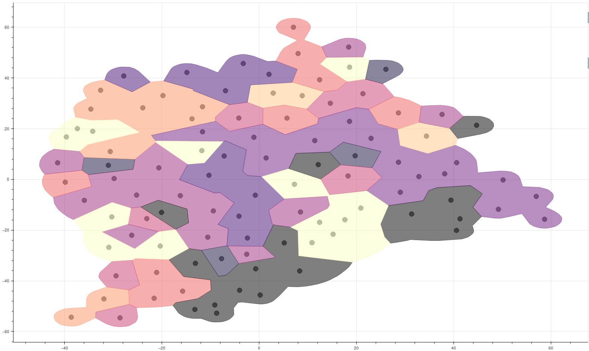

# Categorical Data Representation

A method for embedding and visualizing N-dimensional data points in a categorical-only feature space.

This repo is part of an ongoing project at [\[1\]](#ref1).

# Usage

The script `visualize.py` is called to generate the image. Here, `loader_template.py` is called with a method, `loadData()` which returns a DataFrame where each row corresponds to a data point and each column to a discrete feature. Each cell has the value (e.g. a string) for a label of the feature.

A developer might whish to desire a `loader.py` to load and manipulate data before handing it to `visualize.py`.

After data is loaded, a `DataObject` instance is created which operates the data to embed it in a 2D plane and give information of borders for the graph.

The data itself is mapped to an euclidean space equivalent to the discrete one using probability that object `a` equals `b` to define the coordinates `x[a,b]` and `x[b,a]` [\[2\]](#ref2).

Then, a GMap method is used to find borders on top of one of the original features and the embedded data.\[[3](#ref3), [4](#ref4)\].

Finally, Bokeh is used as a visual tool for the GMap generated.

# Example

By using `loader_template.py`, one can generate a graph by:
```
python visualize.py
```
The result is:




# References

* <a name="ref1">[1]</a>  [COVID 19 en español: Investigación interdisciplinar sobre terminología, temáticas y comunicación de la ciencia](https://pti-esciencia.csic.es/project/covid19-en-espanol-investigacion-interdisciplinar-sobre-terminologia-tematicas-y-comunicacion-de-la-ciencia/)

* <a name="ref2">[2]</a>  Y. Qian, F. Li, J. Liang, B. Liu and C. Dang, "[Space Structure and Clustering of Categorical Data,](https://www.doi.org/10.1109/TNNLS.2015.2451151)" in IEEE Transactions on Neural Networks and Learning Systems, vol. 27, no. 10, pp. 2047-2059, Oct. 2016, doi: 10.1109/TNNLS.2015.2451151.

* <a name="ref3">[3]</a>  E. R. Gansner, Y. Hu and S. Kobourov, "[GMap: Visualizing graphs and clusters as maps](https://www.doi.org/10.1109/PACIFICVIS.2010.5429590)," 2010 IEEE Pacific Visualization Symposium (PacificVis), 2010, pp. 201-208, doi: 10.1109/PACIFICVIS.2010.5429590.

* <a name="ref4">[4]</a>  [GMap: Python implementation of the GMap algorithm for data visualization](https://gitlab.ifca.es/alonsoj/gmap).
